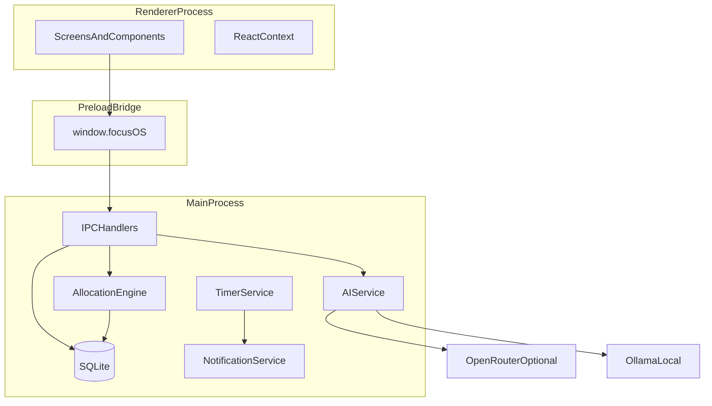

# Architecture

Focus OS is a local-first Electron desktop application with a clear split between privileged backend work (main process) and the React UI (renderer). Scheduling logic lives in a standalone, testable module; AI is an optional advisory layer.

## High-Level Overview

```
┌─────────────────────────────────────────────────────────────────┐
│                     Renderer (React + TS)                       │
│  Chat Shell │ Icon Rail │ Legacy Screens │ Context │ Components │
└────────────────────────────┬────────────────────────────────────┘
                             │ contextBridge (preload)
                             │ invoke / on events
┌────────────────────────────▼────────────────────────────────────┐
│                     Main Process (Node + Electron)                │
│  IPC Handlers │ SQLite │ Timers │ Notifications │ AI Router     │
└────────────────────────────┬────────────────────────────────────┘
                             │
         ┌───────────────────┼───────────────────┐
         ▼                   ▼                   ▼
   better-sqlite3      OS Notifications      OpenRouter / Ollama
   (focus-os.db)       (micro-breaks)        (Daily Insight only)
```



## Design Principles

1. **Local-first**: All user data stored in SQLite on disk; app functions fully offline except optional OpenRouter calls.
2. **Deterministic scheduling**: Allocation engine produces schedules from explicit inputs; same inputs yield same output.
3. **AI advisory boundary**: AI reads snapshots and returns text insights; it never writes schedule or task rows directly.
4. **Thin IPC, fat shared types**: Payload shapes defined in `src/shared/types/` and reused everywhere.
5. **Testability**: Pure allocation module tested without Electron; DB layer tested with temp databases.
6. **File size discipline**: No source file exceeds 1000 lines; split modules early per [rules.md](./rules.md).

## Main Process Responsibilities

| Area | Responsibility |
|------|----------------|
| Application lifecycle | Create window, handle quit, single-instance lock (optional) |
| SQLite | Open DB, migrations, CRUD for all 9 tables, transactions |
| Allocation persistence | Invoke allocation engine, write `daily_schedule` and related rows atomically |
| Timers | Micro-break interval (~90 min), staleness check interval, active block clock sync |
| Notifications | Desktop notifications for breaks, staleness, optional insight ready |
| AI routing | OpenRouter HTTP (primary), Ollama HTTP (fallback), timeout and error handling |
| Config | Load `.env`, merge with `app_settings`, secure API key access |
| File paths | Resolve userData DB path, optional dev overrides |

### Main Module Layout

```
src/main/
├── index.ts                 # App bootstrap, BrowserWindow
├── ipc/
│   ├── index.ts             # Register all handlers
│   ├── scheduleHandlers.ts
│   ├── taskHandlers.ts
│   ├── clientHandlers.ts
│   ├── journalHandlers.ts
│   ├── insightHandlers.ts
│   └── settingsHandlers.ts
├── db/
│   ├── connection.ts
│   ├── migrations/
│   └── repositories/        # One module per aggregate (tasks, schedule, etc.)
├── services/
│   ├── timerService.ts      # Micro-break + staleness timers
│   ├── journalService.ts    # Faith log upsert, stats, complete-faith-block transaction
│   ├── reviewService.ts     # Compose reviewRepository + shared/review aggregators
│   ├── insightService.ts    # Daily snapshot + AI generation + insights_log persistence
│   ├── aiService.ts         # OpenRouter/Ollama routing with graceful fallback
│   └── notificationService.ts
└── allocation/
    └── runAllocation.ts     # Load DB state → engine → persist (orchestration)
```

## Renderer Process Responsibilities

| Area | Responsibility |
|------|----------------|
| UI shell | Chat-first thread, collapsible icon rail, top status bar, routing |
| Chat orchestrator | Intent router (shared), template responses, sessionStorage history |
| Legacy screens | Dashboard, Daily Workspace, Task Matrix, Schedule, Daily Insight, Journal, Review, Settings (secondary access via icon rail or `/menu`) |
| Forms & modals | Long break (top bar shortcut), micro-break activity picker |
| Local UI state | Selected filters, modal open state, draft form fields |
| Display | Timelines, CSS flex bar charts on Review (no chart library), streak badges, focus score visualization |
| IPC client | Call preload API; subscribe to push events |

### Renderer Module Layout

```
src/renderer/
├── main.tsx
├── App.tsx                  # Router + layout shell
├── routes.tsx
├── chat/                    # Primary UI (Phase 13+)
│   ├── ChatShell.tsx
│   ├── ChatThread.tsx
│   ├── ChatInputBar.tsx
│   ├── TypingIndicator.tsx
│   ├── AnimatedChatMessageBubble.tsx
│   ├── SuggestionChips.tsx
│   ├── ScreenIconRail.tsx
│   └── hooks/
│       ├── useChatSession.ts
│       ├── useChatOrchestrator.ts
│       ├── useAssistantDelivery.ts
│       └── useProactiveGreeting.ts
├── context/
│   ├── ChatContext.tsx
│   ├── ScheduleContext.tsx
│   ├── SettingsContext.tsx
│   └── NotificationContext.tsx
├── screens/
│   ├── Dashboard/
│   ├── DailyWorkspace/
│   ├── TaskMatrix/
│   ├── Schedule/
│   ├── DailyInsight/
│   ├── Journal/
│   ├── Review/
│   └── Settings/
├── components/
│   ├── layout/              # TopBar, icon rail helpers
│   ├── schedule/            # Timeline, BlockCard
│   └── shared/              # Button, Input, Badge
└── hooks/
    ├── useIpc.ts
    └── useCurrentBlock.ts

src/shared/chat/             # Testable intent router (no Electron)
├── intentRouter.ts          # classifyIntent()
├── greeting.ts              # Time-aware greeting and welcome-back copy
├── typingDelay.ts           # Assistant typing delay helpers
├── suggestionChips.ts       # Contextual quick-action chips
├── proactiveGreetingSession.ts
├── responseTemplates.ts     # Template-based assistant text
├── routerContext.ts
├── parsers/                 # Wake time, duration, client, block title
└── intents/                 # One module per intent category
```

## Chat Shell and Intent Router (Phase 13+)

Focus OS uses a **chat-first primary interface** at route `/`. The existing eight screens remain available via a collapsible icon rail and the `/menu` chat command.

### Message Flow

```
User types in ChatInputBar
  → useChatOrchestrator.processMessage()
  → classifyIntent() in src/shared/chat/intentRouter.ts (pure, deterministic)
  → if unrecognized or ambiguous: responseTemplates only (no IPC)
  → else: window.focusOS.* IPC calls (existing handlers, unchanged)
  → responseTemplates build assistant text from IPC results
  → useAssistantDelivery shows typing indicator (650-1100ms) then appends message
  → ChatMessage persisted in sessionStorage (last 80 messages)
```

### Persistence

Chat history uses **sessionStorage** (`focus-os-chat-v1`), capped at 80 messages. Proactive greeting uses **sessionStorage** (`focus-os-greeting-sent-v1`) so it fires once per app session. Optional display name for greetings: `app_settings.user_display_name` (Settings → Time And Calendar → Your Name).

### Proactive greeting and typing delivery

On Chat mount, `useProactiveGreeting` checks wake time and schedule state, then delivers one or two assistant messages via `useAssistantDelivery`:

1. Time-aware greeting (`Good morning.` or `Good morning, Name.`)
2. Wake-time follow-up if wake time not logged (`What time did you wake up?`)

If wake time is already logged, a welcome-back message references the active block, next block, or missing schedule.

Before each assistant message, a **typing indicator** shows for 650-1100ms (random), with a 350ms gap between sequential greeting messages. All intent-router responses use the same delivery pipeline.

**Framer Motion** (limited scope, not full Phase 17): `TypingIndicator` dot animation, `AnimatedChatMessageBubble` slide-up + fade (200ms).

**Suggestion chips** below the thread (above input) are contextual: wake shortcuts, day-ready actions, or long-break actions. Chips call the same `sendMessage` path as typed input.

### Conversation State

The orchestrator tracks `pendingPrompt` (wake time), `longBreakActive`, and faith block context. On first open each day without `wake_time`, the assistant proactively asks for wake time and replaces the Phase 5 wake modal.

### Future Hook Points

| Phase | Hook location | Purpose |
|-------|---------------|---------|
| 14 | `intentRouter.ts` after deterministic pass | AI fallback for ambiguous input |
| 15 | `ChatMessage.attachments` + `ChatMessageBubble` | Inline rich components (schedule cards, etc.) |
| 16 | `ChatInputBar` mic button | Voice input |
| 17 | Chat UI components | Motion and transitions |
| 18 | Orchestrator + router | Migrate remaining screen workflows into chat |

## Preload and IPC Pattern

The preload script exposes a minimal typed API on `window.focusOS` via `contextBridge.exposeInMainWorld`.

### Security

- `nodeIntegration: false`, `contextIsolation: true`.
- Only whitelisted channels exposed; no raw `ipcRenderer` in renderer.

### Communication Styles

**Request/response (renderer → main)**

```typescript
// Renderer
const schedule = await window.focusOS.schedule.generate({ wakeTime, date });

// Main handler
ipcMain.handle('schedule:generate', async (_event, payload) => {
  return runAllocation(payload);
});
```

**Push events (main → renderer)**

```typescript
// Main (timer fired)
mainWindow.webContents.send('break:micro-break-due', { suggestedActivities });

// Renderer subscribe
window.focusOS.onMicroBreakDue(callback);
```

### IPC Channel Map (Planned)

| Channel | Direction | Purpose |
|---------|-----------|---------|
| `schedule:generate` | invoke | Full day generation from wake time |
| `schedule:reallocate` | invoke | Post-long-break re-allocation |
| `schedule:get-day` | invoke | Fetch blocks for date |
| `schedule:complete-block` | invoke | Mark block actual end, update metrics |
| `tasks:*` | invoke | CRUD + matrix queries |
| `clients:*` | invoke | CRUD clients/projects |
| `journal:*` | invoke | Faith log read/write, search, stats, complete-faith-block |
| `review:get-summary` | invoke | Planned vs actual, breaks, task completion for date range |
| `insights:generate` | invoke | Build snapshot, call AI, persist to insights_log |
| `insights:get-today` | invoke | Latest insight for a date |
| `insights:list` | invoke | Insight history |
| `settings:test-ai-providers` | invoke | Minimal OpenRouter/Ollama connectivity test |
| `settings:*` | invoke | App and daily settings |
| `breaks:log` | invoke | Record micro/long break |
| `break:micro-break-due` | event | Popup trigger |
| `staleness:alert` | event | Client untouched threshold |

Types for every payload live in `src/shared/types/ipc.ts`.

## Standalone Allocation Engine

Location: `src/shared/allocation/`

Pure TypeScript module with no Electron or React imports.

```
src/shared/allocation/
├── index.ts                 # Public API: allocateDay, reallocateAfterLongBreak
├── types.ts                 # Block, Task, ClientInput, AllocationResult
├── steps/
│   ├── placeProtectedBlocks.ts
│   ├── placeFixedClientBlocks.ts
│   ├── applyBuffer.ts
│   ├── distributeWeighted.ts
│   └── fillTasksByPriority.ts
├── reallocate.ts            # Long break compression + task bumping
└── constants.ts             # MIN_VIABLE_BLOCK_MINUTES, defaults
```

**Inputs**: wake time, date, clients (weights, fixed windows, active flag), tasks (priority, deadline, client), protected block config, daily settings (buffer %), existing break log for the day.

**Outputs**: ordered list of schedule blocks with assigned tasks, bumped task IDs, warnings (staleness passed through separately).

Main process `runAllocation.ts` loads rows from SQLite, maps to engine types, runs engine, persists results in a transaction.

Unit tests import engine directly without starting Electron.

## AI Service Layer

Location: `src/main/services/aiService.ts`

### Provider Routing

```
1. If OpenRouter API key present → POST to OpenRouter with configured model
2. Else if Ollama endpoint reachable → POST to local Ollama
3. Else → return structured "unavailable" insight; log source `none`
```

### Prompt Construction

Builds a **snapshot** from:

- Today's schedule summary (block types, client names, durations)
- Task list highlights (overdue, high priority)
- Staleness alerts
- Faith Streak and yesterday journal presence
- Yesterday planned vs actual hours (aggregated)

Does **not** include: raw API keys, full historical journal text (summaries/excerpts only), or system file paths.

### Response Handling

- Store result in `insights_log` with `source`: `openrouter` | `ollama` | `none`.
- Return markdown or structured sections to renderer for Daily Insight screen.
- Timeout and retry once on transient failure; then fall back down the chain.

### Graceful Degradation

UI shows last cached insight, partial template, or friendly offline message. Schedule UI unaffected.

## Notification System

`notificationService.ts` wraps Electron `Notification` API (or node-notifier if needed cross-platform during dev).

| Trigger | Source |
|---------|--------|
| Micro-break due | timerService (~90 min focus elapsed) |
| Staleness warning | timerService periodic check |
| Daily Insight ready | aiService completion (optional) |

Respects `app_settings` notification preferences (enable/disable per category).

## Timer System

`timerService.ts` runs in main process:

- **Focus timer**: Tracks elapsed time in current work block; resets on block change or micro-break.
- **Micro-break scheduler**: Fires ~90 minutes after last micro-break or day start (configurable later).
- **Staleness checker**: Interval (e.g. every 15 min) compares `last_touched_at` per active client against threshold from settings; emits `staleness:alert` events.

Timers pause or adjust on long break start/end per product rules (documented in ALLOCATION_ENGINE.md for schedule; timers sync wall clock with active block).

## Data Flow Examples

### Morning Wake-Time Flow

1. User opens app; chat assistant asks "What time did you wake up?" if no wake time logged today.
2. User replies (e.g. "9am"); intent router parses wake time.
3. Renderer calls `daily:upsert`, then `schedule:generate`, then `schedule:commit` (same IPC as Daily Workspace).
4. Assistant responds with a text summary of today's schedule; ScheduleContext refreshes.

### Long Break Return Flow

1. User clicks long break, enters reason/duration; `breaks:log` with type `long`.
2. Timers paused; UI shows break state.
3. On return, user confirms; `schedule:reallocate` with `returnTime`.
4. Engine preserves protected blocks, compresses client blocks, bumps tasks if needed.
5. Main replaces future blocks for the day in DB; renderer refreshes.

### Daily Insight Flow

1. User opens Daily Insight or auto-trigger on first open each day.
2. `insights:generate` builds snapshot, calls aiService.
3. Insight stored in `insights_log`; displayed read-only.
4. No schedule tables modified.

## Folder Structure Proposal

Full tree (target end state):

```
focus-os/
├── README.md
├── ARCHITECTURE.md
├── SCHEMA.md
├── ALLOCATION_ENGINE.md
├── src/
│   ├── main/                # See Main Module Layout above
│   ├── preload/
│   │   └── index.ts
│   ├── renderer/            # See Renderer Module Layout above
│   └── shared/
│       ├── types/
│       ├── allocation/      # Standalone engine
│       └── constants/
├── tests/
│   ├── allocation/
│   └── db/
├── resources/
│   ├── icon.ico
│   └── icon.png
├── electron-builder.yml
├── package.json
├── tailwind.config.js
├── tsconfig.json
└── vite.config.ts           # Or equivalent bundler config
```

## Technology Boundaries

| Concern | Allowed in renderer | Allowed in main |
|---------|---------------------|-----------------|
| better-sqlite3 | No | Yes |
| fs / path | No | Yes |
| fetch to OpenRouter | No (use main) | Yes |
| React | Yes | No |
| Allocation engine pure functions | Import for preview only (optional) | Yes (authoritative run) |

Optional: renderer may call a **read-only preview** of allocation for instant UI feedback before save; persisted schedule always from main.

## Error Handling

- IPC handlers return `{ ok: true, data }` or `{ ok: false, error: { code, message } }` for consistent renderer handling.
- DB writes use transactions; failed allocation rolls back.
- Log errors in main process file (rotating log in userData, not committed to repo).

## Future Considerations (Out of Scope for 0.1.0)

- Multi-window support
- Cloud sync
- macOS/Linux packaging
- Plugin system

## Related Documents

- [SCHEMA.md](./SCHEMA.md)
- [ALLOCATION_ENGINE.md](./ALLOCATION_ENGINE.md)
- [DEVELOPMENT.md](./DEVELOPMENT.md)
- [SECURITY.md](./SECURITY.md)
